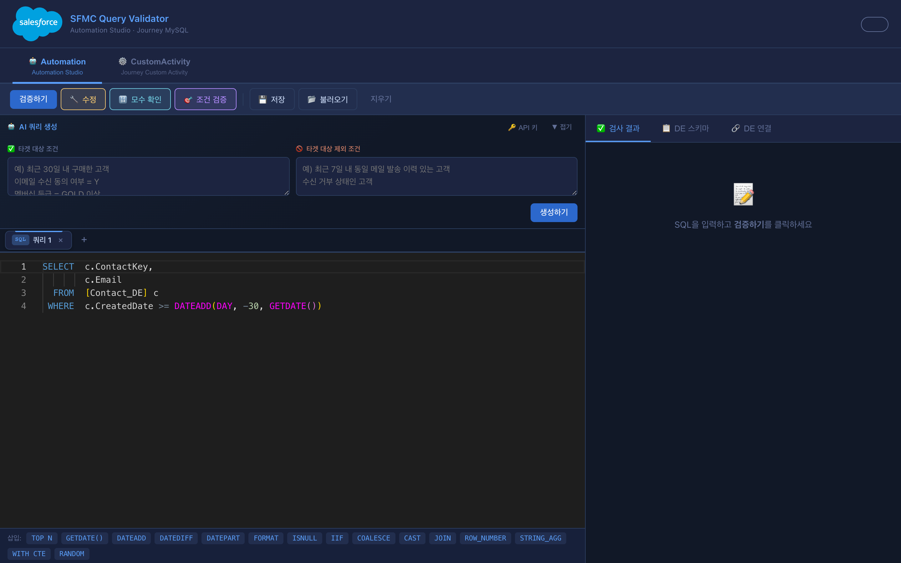
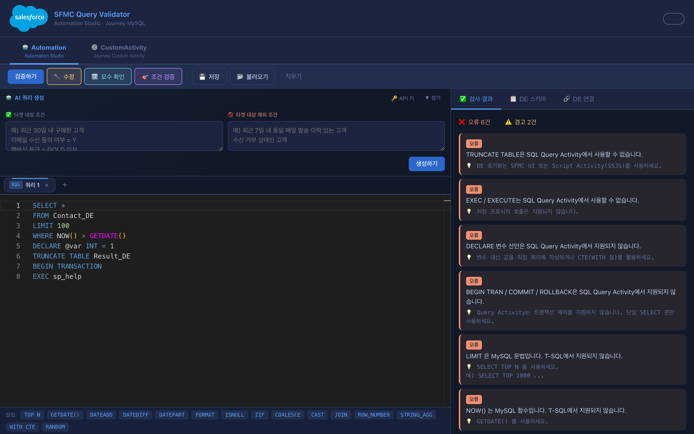
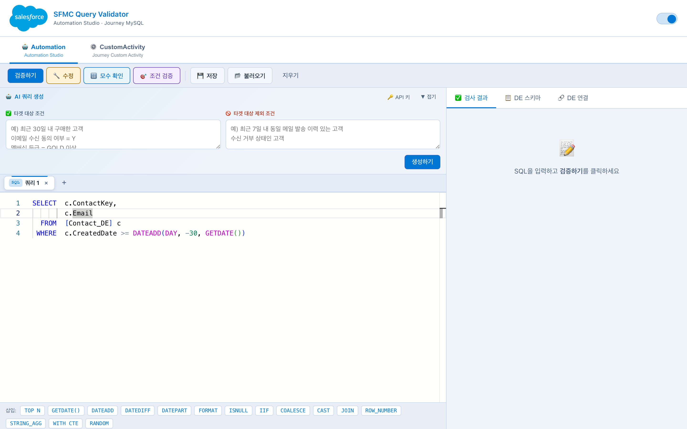

# SFMC Query Validator

> SFMC 운영 현장에서 반복되는 쿼리 오류를 없애기 위해 직접 만든 검증·생성 도구

🔗 **라이브 데모:** https://10se0hyun02.github.io/sfmc-query-validator/


---

## 스크린샷

**다크 모드 — AI 쿼리 생성 패널**


**검증 결과 — 오류·경고 목록**


**라이트 모드**


---

## 왜 만들었나

Salesforce Marketing Cloud(SFMC)의 SQL Query Activity는 일반 T-SQL과 미묘하게 다릅니다.  
`LIMIT` 대신 `SELECT TOP`, `NOW()` 대신 `GETDATE()`, `DECLARE` 불가, 임시 테이블 불가…

운영 중 쿼리 하나가 틀리면 Automation이 통째로 실패하고, 원인 파악까지 시간이 걸립니다.  
오류 유형이 반복되는 걸 보고 **"이건 도구가 없어서 생기는 문제다"** 싶어서 직접 만들었습니다.

---

## 주요 기능

### 🤖 Automation (T-SQL) — SFMC SQL Query Activity 검증

- **30개+ 검증 규칙** — 비지원 구문(DML/DDL/트랜잭션), MySQL/Oracle 함수 오용, 문법 오류 감지
- **자동수정** — 감지된 오류를 T-SQL 문법으로 자동 변환, 수정 라인에 `-- [수정]` 주석 삽입
- **AI 쿼리 생성** — 포함/제외 조건을 자연어로 입력하면 T-SQL 자동 생성
  - T0→T1→BASE→FIN 4계층 서브쿼리 구조 강제 적용
  - 실제 DE/컬럼명 기반 (hallucination 방지)
- **🎯 조건 검증** — 쿼리가 입력한 조건을 실제로 충족하는지 항목별 pass/fail 판정
- **🔢 모수 확인** — SFMC에 쿼리를 직접 실행해 추출 건수 반환 (SOAP + REST API)
- **멀티탭 에디터** — 여러 쿼리를 탭으로 관리, localStorage 자동 저장
- **DE 스키마 브라우저** — 연결 없이 DE/컬럼 구조 즉시 조회, Monaco 자동완성 연동

### ⚙️ CustomActivity (MySQL) — Journey Builder Custom Activity 검증

- 6종 테이블 템플릿 내장 (SS_HIST, CA_MAIL, CA_SMS, CA_CMC_TGT, CA_CMC_CMP, SS_HIST_DTL)
- MySQL 전용 규칙 검증 및 자동수정

---

## 기술 스택

| 분류 | 기술 | 선택 이유 |
|------|------|-----------|
| 에디터 | Monaco Editor | VS Code와 동일 엔진, 자동완성·하이라이트 |
| 언어 | Vanilla JavaScript | 프레임워크 없이 단일 파일 배포 |
| 배포 | GitHub Pages | 별도 서버 없이 URL 하나로 공유 |
| CORS 프록시 | Cloudflare Workers | 브라우저→SFMC API 호출 우회 |
| AI | Groq / OpenRouter / Gemini / Cerebras | 무료 공급자 자동 폴백 |
| SFMC API | REST + SOAP | DE 조회, 모수 확인 |

---

## 파일 구조

```
sfmc-query-validator/
├── index.html        ← 전체 UI (단일 파일)
├── validator.js      ← T-SQL / MySQL 검증·자동수정 엔진
├── data-schema.js    ← DE 스키마 정의 (자동완성 소스)
├── worker.js         ← Cloudflare Worker CORS 프록시
├── wrangler.toml     ← Cloudflare 배포 설정
└── style.css         ← 다크/라이트 테마
```

---

## 실행 방법

**온라인:** https://10se0hyun02.github.io/sfmc-query-validator/

**로컬:** `index.html`을 브라우저로 열면 바로 실행됩니다. (설치 불필요)

> Monaco Editor, Tailwind CSS를 CDN에서 로드하므로 인터넷 연결이 필요합니다.

---

## AI 기능 설정

AI 쿼리 생성 / 조건 검증을 사용하려면 무료 API 키가 필요합니다.

| 공급자 | 키 발급 | 무료 한도 |
|--------|---------|-----------|
| **Cerebras** | [cloud.cerebras.ai](https://cloud.cerebras.ai) | 1일 100만 토큰 |
| **Groq** | [console.groq.com](https://console.groq.com) | 1일 14,400 요청 |
| OpenRouter | [openrouter.ai](https://openrouter.ai) | 무료 모델 제공 |
| Gemini | [aistudio.google.com](https://aistudio.google.com) | 무료 티어 |

키를 입력하면 자동 감지 후 우선순위에 따라 공급자를 선택합니다. 429 오류 시 자동으로 다음 공급자로 전환합니다.

---

## DE 연결 및 CORS 프록시 설정

SFMC API는 브라우저에서 직접 호출 시 CORS 오류가 발생합니다.  
`worker.js`를 Cloudflare Worker로 배포해 프록시로 사용합니다.

```bash
# Cloudflare 계정 생성 후
npx wrangler deploy
```

또는 Cloudflare 대시보드에서 `worker.js` 내용을 직접 붙여넣기 후 배포.

**Installed Package 발급:**
1. SFMC → Setup → Installed Packages → New
2. Add Component → API Integration → Server-to-Server
3. 권한: Data Extensions (Read / Write)
4. Client Id, Client Secret, Subdomain 복사

---

## 검증 규칙 참고

<details>
<summary>T-SQL 비지원 구문 목록 (펼치기)</summary>

| 규칙 | 설명 |
|------|------|
| UPDATE / DELETE / INSERT | Query Activity는 SELECT 전용 |
| CREATE / DROP / ALTER / TRUNCATE / MERGE | DDL/DML 불가 |
| EXEC / EXECUTE | 저장 프로시저 호출 불가 |
| #temp 임시 테이블 | 별도 DE에 저장할 것 |
| DECLARE / @변수 | 변수 선언 불가 |
| BEGIN TRAN / COMMIT / ROLLBACK | 트랜잭션 불가 |
| BEGIN TRY / BEGIN CATCH | 예외 처리 불가 |
| FOR XML / FOR JSON | 포맷 변환 불가 |
| BULK INSERT / OPENQUERY | 외부 접근 불가 |
| GO / SET / USE / PRINT / WAITFOR | 지원 안됨 |

</details>

<details>
<summary>MySQL ↔ T-SQL 함수 대응표 (펼치기)</summary>

| MySQL | T-SQL |
|-------|-------|
| `LIMIT N` | `SELECT TOP N` |
| `NOW()` | `GETDATE()` |
| `DATE_ADD(d, INTERVAL N DAY)` | `DATEADD(DAY, N, d)` |
| `IFNULL(col, x)` | `ISNULL(col, x)` |
| `IF(cond, a, b)` | `IIF(cond, a, b)` |
| `CHAR_LENGTH()` / `LENGTH()` | `LEN()` |
| `LOCATE()` | `CHARINDEX()` |
| `GROUP_CONCAT()` | `STRING_AGG()` |
| `STR_TO_DATE()` | `CONVERT(DATE, ...)` |
| `REPEAT()` | `REPLICATE()` |

</details>

<details>
<summary>Oracle ↔ T-SQL 함수 대응표 (펼치기)</summary>

| Oracle | T-SQL |
|--------|-------|
| `SYSDATE` | `GETDATE()` |
| `NVL(col, x)` | `ISNULL(col, x)` |
| `TO_CHAR(d, fmt)` | `FORMAT(d, fmt)` |
| `DECODE()` | `CASE WHEN` |
| `ROWNUM` | `ROW_NUMBER() OVER (...)` |
| `INSTR(str, sub)` | `CHARINDEX(sub, str)` ※인수 순서 반대 |
| `LPAD()` / `RPAD()` | `RIGHT(REPLICATE(...) + ...)` |

</details>

---

## 버전 히스토리

| 버전 | 주요 변경 |
|------|-----------|
| [v1.3.0](https://github.com/10se0hyun02/sfmc-query-validator/releases/tag/v1.3.0) | Cerebras 지원, 다크모드 개선, 멀티키 |
| [v1.2.0](https://github.com/10se0hyun02/sfmc-query-validator/releases/tag/v1.2.0) | 멀티탭 에디터, OpenRouter 다중 AI 공급자 |
| [v1.1.0](https://github.com/10se0hyun02/sfmc-query-validator/releases/tag/v1.1.0) | 모수 확인 (SFMC SOAP + REST API) |
| [v1.0.0](https://github.com/10se0hyun02/sfmc-query-validator/releases/tag/v1.0.0) | AI 쿼리 생성 + 조건 검증 통합 |
| [v0.4.0](https://github.com/10se0hyun02/sfmc-query-validator/releases/tag/v0.4.0) | DE 스키마 브라우저, 자동완성 |
| [v0.3.0](https://github.com/10se0hyun02/sfmc-query-validator/releases/tag/v0.3.0) | SFMC API 연동, 검증 규칙 30개+ |
| [v0.2.0](https://github.com/10se0hyun02/sfmc-query-validator/releases/tag/v0.2.0) | CustomActivity 탭, 자동수정 엔진 |
| [v0.1.0](https://github.com/10se0hyun02/sfmc-query-validator/releases/tag/v0.1.0) | T-SQL 기본 검증 |

---

## 올바른 SFMC T-SQL 예시

```sql
SELECT TOP 1000
    c.ContactKey,
    c.Email,
    c.FirstName,
    o.OrderAmount
INTO [Result_DE]
FROM [Contact_DE] c
INNER JOIN [Order_DE] o
    ON c.ContactKey = o.ContactKey
WHERE o.OrderDate >= DATEADD(DAY, -30, GETDATE())
  AND ISNULL(c.OptOut, 'N') = 'N'
```
